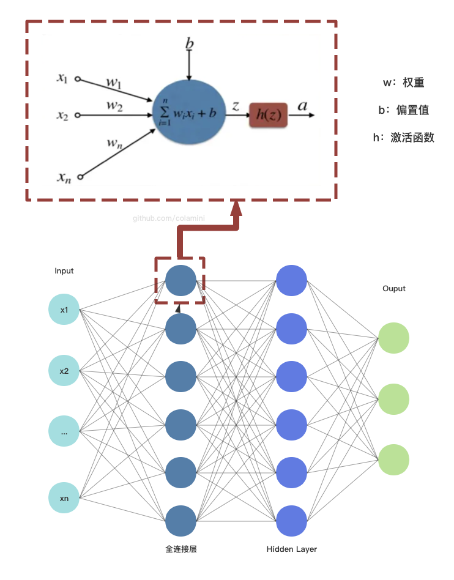
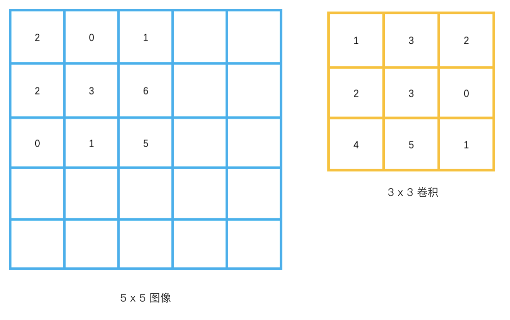
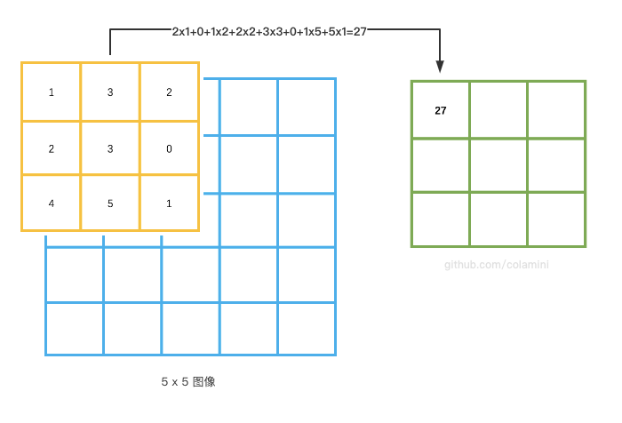
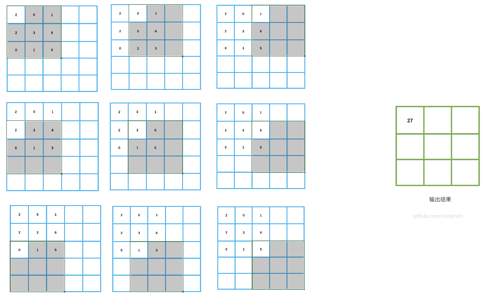
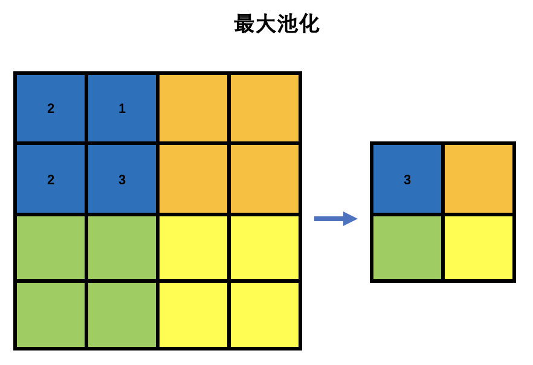
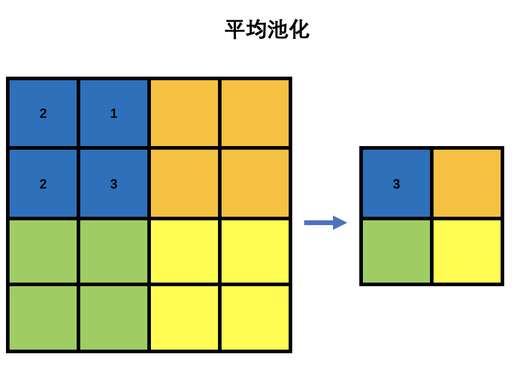

# PyTorch常见的神经网络层和 API

❓ 想必机器学习入门的同学们都很想知道，输入的`tensor`经过**多层神经网络操作**之后，都发生了什么改变？

❓ 如果我们要对`tensor`进行变换 **（升维、降维、变维等）**，有哪些常用的方法以及 `API` 呢？

❓ 想必初学者最经常看到以下的报错，但是却不知道如何修改？
```shell
RuntimeError: mat1 and mat2 shapes cannot be multiplied (3584x28 and 12544x512)
RuntimeError: only batches of spatial targets supported (3D tensors) but got targets of dimension: 1
```

**因此，本文梳理了两个重点如下 ⬇️**
- 1、常见的神经网络层的原理
- 2、改变`tensor`的`形状（shape）`常用的方法以及API

---

## 1. 常见的神经网络层原理

下面主要梳理了，经过常见的神经网络层后，输入的tensor发生了什么改变～


### 1.1 全连接层
> 全连接操作是一种常用的神经网络操作，它将输入`tensor`中的每个元素都连接到输出`tensor`中的每个元素，使用**权重矩阵**对它们进行线性变换，并加上**偏置项**，最终生成一个新的`tensor`。在这个过程中，`tensor`的`shape`通常会发生变化。
 

上面的描述有点抽象，我用下面这张图来解释一下 ⬇️


其中每个神经元都会做一系列`线性变换`操作，再利用`激活函数`处理一下输出。如上图所示，全连接层将输入`tensor`中的每个元素都连接到输出`tensor`中的每个元素，使用**权重矩阵**对它们进行线性变换，并加上**偏置项**，最终生成一个新的`tensor`。

#### 举两个 🌰🌰

例如，对于一个二维的输入`tensor`，如果它的形状是 `(batch_size, input_size)`，那么全连接层的权重矩阵的形状通常是 `(input_size, output_size)`，最后生成一个新的形状为 `(batch_size, output_size)` 的输出tensor。

```python
torch.Size([2, 3]) # 输入：batch_size = 2, input_size = 3
nn.Linear(3, 4)  # i经过全连接层：nput_size = 3,m output_size = 4 之后
torch.Size([2, 4]) # 输出：batch_size = 2, output_size = 4
```
---

对于一个三维的输入张量，如果它的形状是 `(batch_size, channels, input_size)`，其中 `channels` 是输入的通道数，`input_size` 是输入的特征数量，那么全连接层的权重矩阵的形状通常是 `(input_size, output_size)`。全连接操作将输入张量中与权重矩阵相乘，并加上偏置项，生成一个新的形状为 `(batch_size, channels, output_size)`的输出张量。
```python
torch.Size([2, 3， 4]) # 输入：batch_size = 2, channels = 3, input_size = 4
nn.Linear(4, 5) # 经过全连接层：input_size = 4, output_size = 5 
torch.Size([2, 3, 5]) # 输出：batch_size = 2, channels = 3, output_size = 5
```

## 1.2 卷积层
> 卷积操作是一种常用的神经网络操作，它可以在输入的张量上滑动一个固定大小的窗口，并对窗口内的数据进行**加权求和**，生成一个新的张量。在这个过程中，张量的形状可能会发生变化，具体取决于所使用的卷积核的大小和步幅。

例如，下面有一个5x5大小的图像，以及一个3x3的卷积核 ⬇️



首先，对第一个窗口的数据进行一一**加权求和**，求和之后的结果为27 ⬇️



❓ 那么为什么输出结果是 3x3 的矩阵呢？在这里我们用`步长strike等于1` 演示一下，即每次滑动一格 ⬇️ 



可以看到卷积核大小的窗口在图像上进行滑动，最终输出结果的宽为：
>（原始图像宽 - 卷积核宽 + 2 x 填充（这里暂时不细讲）） / 步长 + 1

高度计算同理。

### 1.3池化层


> **池化操作** 是一种常用的特征`降维`方法，通常用于卷积神经网络中。池化操作将一个固定大小的窗口滑过输入的张量，然后对每个窗口内的元素进行`聚合操作`，例如取`最大值`或`平均值`等，得到一个新的张量。

池化操作会改变张量的形状，具体变化取决于池化的方式和参数设置。通常情况下，池化操作会减小张量的空间维度，例如减小宽度和高度，但保持深度（通道数）不变。




> 需要注意的是，池化操作通常不会改变输入张量的批量大小（batch size），因此在输出张量的形状中，第一个维度的大小和输入张量保持一致。


## 2.PyTorch改变tensor数据维度
另外，初学者还想知道，如果我们要得到一个特定维度的tensor（用于进行数学运算、计算损失的时候），如**升维、降维、变维**等。应该用什么API对tensor进行操作呢？
  

### 2.1 view
返回相同数据，仅改变 `tensor` 的`shape`。
>Returns a new tensor with the same data as the self tensor but of a different shape.


```python
import torch
x = torch.randn(4, 4)
x.size() # torch.Size([4, 4])
y = x.view(16)
y.size() # torch.Size([16])
z = x.view(-1, 8)  # the size -1 is inferred from other dimensions
z.size() # torch.Size([2, 8])

a = torch.randn(1, 2, 3, 4)
a.size() # torch.Size([1, 2, 3, 4])
b = a.transpose(1, 2)  # Swaps 2nd and 3rd dimension
b.size() # torch.Size([1, 3, 2, 4])
c = a.view(1, 3, 2, 4)  # Does not change tensor layout in memory
c.size() # torch.Size([1, 3, 2, 4])
```
### 2.2 unsqueeze
返回一个新的 `tensor`，它的指定位置插入了一个新的维度。例如：

```python
import torch
x = torch.tensor([1, 2, 3, 4])
torch.unsqueeze(x, 0) # tensor([[ 1,  2,  3,  4]])
torch.unsqueeze(x, 1)
# tensor([[ 1],
#         [ 2],
#         [ 3],
#         [ 4]]) 
```

### 2.3 split
拆分 `tensor`，在原`tensor`上进行操作，会改变原来的`tensor`。例如：
```python
a = torch.arange(10).reshape(5, 2)
print(a)
# tensor([[0, 1],
#         [2, 3],
#         [4, 5],
#         [6, 7],
#         [8, 9]])
torch.split(a, 2)
# (tensor([[0, 1],
#          [2, 3]]),
#  tensor([[4, 5],
#          [6, 7]]),
#  tensor([[8, 9]]))
torch.split(a, [1, 4])
# (tensor([[0, 1]]),
#  tensor([[2, 3],
#          [4, 5],
#          [6, 7],
#          [8, 9]]))
```

以上就是一些常见的神经网络层的原理，以及一些改变tensor shape API的介绍。
具体可以看 PyTorch 官方文档，有很多API可以使用。


