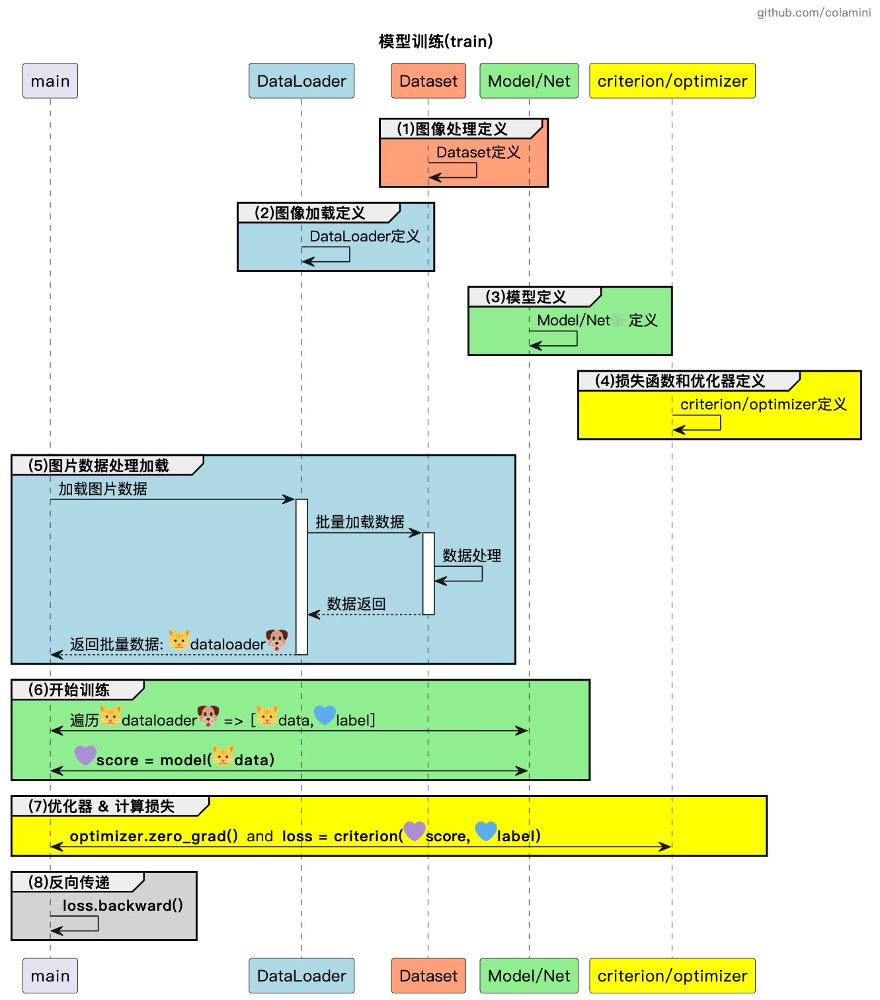
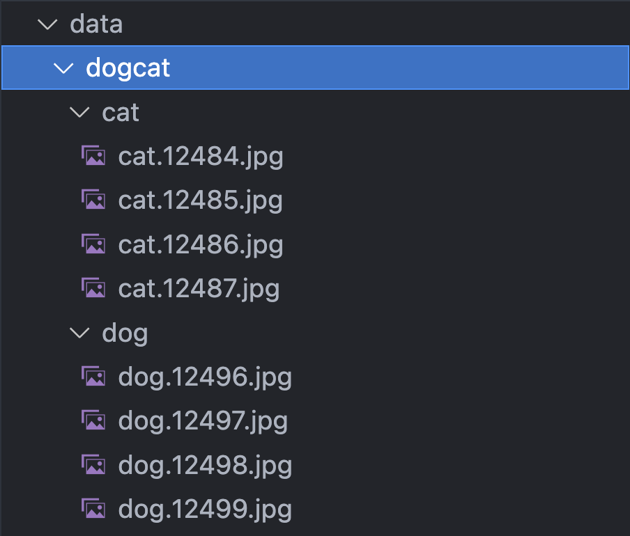

# PyTorch指标可视化

[TOC]

> 在神经网络模型训练过程中往往需要对输出的指标进行可视化，在这里推荐两个实时数据可视化的库：`TensorBroadX`、`Visdom`

**Visdom** 是一种用于实时数据可视化的Python库，特别适用于 `PyTorch` 深度学习框架。它可以用于实时监视和可视化模型的训练和评估指标，例如 **损失函数和准确度。**

---

下面简单介绍一下`Visdom`这个库的用法 ⬇️

## 1. 在 PyTorch 中使用 Visdom
以下是在 `PyTorch` 中使用 `Visdom` 进行可视化的步骤：

### 1.1 安装和启动Visdom服务器

首先，使用 `pip` 来安装 `Visdom`：

```bash
pip install visdom
```
Visdom 启动脚本如下：

```bash
python -m visdom.server
```

在 `Python` 脚本中引入 `Visdom`：

```python
import visdom
vis = visdom.Visdom()
```
---

## 1.2 写一个简单的神经网络模型训练程序
神经网络模型定义与训练有以下几个基本的步骤 ⬇️

```markdown
- 数据预处理与加载模型定义
- 模型定义
- 损失函数损失函数、优化器定义
- 开始训练
    - 加载处理过的图片数据
    - 开始训练（遍历等）
    - 计算损失等
    - 反向传递更新参数
```

在这里我用一张时序图简单地把过程画了一下 ⬇️


具体的代码实现如下。
### 1.2.1 创建数据集对象
```python
data_path = "./data/dogcat" # 图片加载路径，每个子文件夹里面的图片均以分类，这是使用imageFolder的前提条件
```


```python
# 定义transform用于图片预处理
data_transform = transforms.Compose([
    transforms.Resize(40), # 调整大小
    transforms.CenterCrop(32), # 居中裁剪
    transforms.ToTensor(), # 转化为tensor
    transforms.Normalize(mean=[0.5, 0.5, 0.5],
                         std=[0.5, 0.5, 0.5]) # 数据归一化
])
dataset = datasets.ImageFolder(data_path, transform=data_transform) # 使用imageFolder的前提，是需要图片已经分类存放在子文件夹中
```

### 1.2.2 创建数据加载器对象
在这里，使用 `DataLoader` 对数据进行批量加载。
```python
data_loader = torch.utils.data.DataLoader(dataset, batch_size=10, shuffle=True, num_workers=4)
```

### 1.2.3 定义模型和优化器
简单定义一下神经网络模型，以及 `optimizer` 和损失函数，这些 `PyTorch` 都为我们提供了很多现成的模版、方法以供使用（很香哈哈哈）

```python
import torch
import torch.nn as nn
import torch.optim as optim
import torchvision.datasets as datasets
import torchvision.transforms as transforms
import torch.nn.functional as F

# 定义网络模型
class Net(nn.Module):
    def __init__(self):
        super(Net, self).__init__()
        # 第一层（卷积层）
        self.conv1 = nn.Conv2d(3,6,3) #输入频道3， 输出频道6， 卷积3x3
        # 第二层（卷积层）
        self.conv2 = nn.Conv2d(6,16,3) #输入频道6， 输出频道16， 卷积3x3
        # 第三层（全连接层）
        self.fc1 = nn.Linear(16*28*28, 512) #输入维度16x28x28=12544，输出维度 512
        # 第四层（全连接层）
        self.fc2 = nn.Linear(512, 64) #输入维度512， 输出维度64
        # 第五层（全连接层）
        self.fc3 = nn.Linear(64, 10) #输入维度64， 输出维度10

    def forward(self, x):
        x = self.conv1(x)
        x = F.relu(x)
        
        x = self.conv2(x)
        x = F.relu(x)
        
        x = x.view(-1, 16*28*28)
        x = self.fc1(x)
        x = F.relu(x)
        
        x = self.fc2(x)
        x = F.relu(x)
        
        x = self.fc3(x)
        return x

net = Net()
# 定义优化器和损失函数
optimizer = optim.SGD(net.parameters(), lr=0.01)
criterion = nn.CrossEntropyLoss()
```

### 1.2.4 定义一个可视化损失函数的函数

接下来就是使用 `Visdom` 对输出进行可视化了,对 x、y坐标进行了相关的绘制，同时加上了 `title` 等备注信息 ⬇️
```python
def plot_loss(loss, epoch):
    vis.line(
        X=[epoch],
        Y=[loss],
        win='loss',
        update='append',
        opts=dict(title='Training Loss', xlabel='Epoch', ylabel='Loss')
    )
```
### 1.2.5 开始训练

```python
for epoch in range(10):
    running_loss = 0.0
    for i, data in enumerate(trainloader, 0):
        inputs, labels = data # 加载图片数据
        optimizer.zero_grad()
        outputs = net(inputs) # 进行训练
        loss = criterion(outputs, labels) # 计算损失
        loss.backward() # 反向传递
        optimizer.step()
        running_loss += loss.item()
        plot_loss(running_loss / 10, epoch) # 调用指标可视化函数
        running_loss = 0.0
```
---


## 2. 查看结果
```bash
# 首先启动python程序
python visdom_test.py

# 启动visdom
puthon -m visdom.server
```

最后，打开 http://localhost:8097/ 即可看到已经可视化的指标。

以上就是在 `PyTorch` 中使用` Visdom` 进行可视化的一些基本步骤。我们还可以根据需要使用其他可用的函数和参数进行自定义。

## 3. 原理是什么
原理其实非常简单，就是启动两个进程，一个是训练的主流程，一个是visdom web进程。二者进行实时通信，进而在前端界面上把指标实时显示出来。