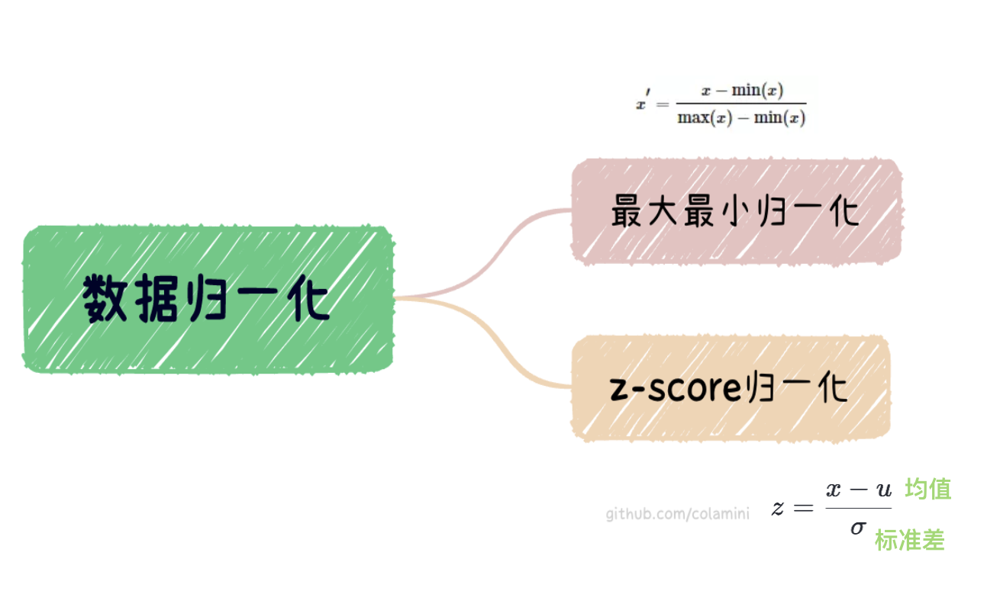

# PyTorch数据转换
[TOC]
## 1. 把图片转为PyTorch张量(Tensor)

将图片转换为 `PyTorch Tensor`也是在计算机视觉领域中的一项常见任务。可以使用 `PyTorch` 的工具 `torchvision` 中的 `transforms` 模块，将图像转换为 `PyTorch 张量`。


> 其中，`Tensor`包括`scalar标量`、`vector向量`、`matrix矩阵`、多维张量等。


以下是使用 `torchvision.transforms` 库将图片转换为 `PyTorch 张量`的示例：

```python
import torch
import torchvision.transforms as transforms
from PIL import Image 


# 创建一个 transforms 对象
transform = transforms.Compose([
    transforms.Resize((224, 224)), # 调整图片大小为 224x224
    transforms.ToTensor() # 将图片转换为 PyTorch 张量
])

# 加载图片
img = Image.open('image.jpg')

# 将图片转换为 PyTorch 张量
img_tensor = transform(img)

# 查看张量shape和数据类型
print(img_tensor.shape) # torch.Size([3, 224, 224]) 
print(img_tensor.dtype) # torch.float32
```
将以上过程总结一下如下⬇️
> - 1、**定义transform**：使用 `torchvision.transforms` 库中的 `Compose()` 函数创建一个 `transforms` 对象，其中包含两个转换操作：`Resize()` 将图片大小调整为`224x224`，`ToTensor()` 将图片转换为 `PyTorch 张量`。

> - 2、**打开图片**：使用  `pillow` 图像处理库中的`Image.open()` 函数加载一张名为 `image.jpg` 的图片。

> - 3、**转换**：使用 `transform()` 方法将图片转换为 `PyTorch张量`。

> - 4、**查看信息**：使用 `shape` 和 `dtype` 属性分别查看张量的shape和数据类型。


## 2. 归一化图片数据

归一化图片数据是将像素值缩放到一个固定范围内，使得所有数据都在同一数量级上。这可以提高模型的训练速度和性能，并减少过拟合的风险。

### 2.1 常见的归一化方法

以下是一些常见的归一化方法：

>- **最大最小值归一化（Min-Max Normalization）**：将像素值缩放到[0,1]的范围内。具体方法是对每个像素值x执行以下操作：(x - min)/(max - min)，其中min和max分别是图像中所有像素值的最小值和最大值。

> - **z-score归一化**：将像素值缩放到均值为0，标准差为1的分布上。具体方法是对每个像素值x执行以下操作：`(x - mean)/std`，其中mean和std分别是图像中所有像素值的均值和标准差。

> - **除以255**：将像素值缩放到[0,1]的范围内，其实就是最大最小值归一化，这种方法是将每个像素值除以255得到的。



在 `PyTorch` 中，可以使用 `torchvision.transforms.Normalize()` 函数来归一化图像数据，`Normalize` 函数采用的归一化方法是`z-score归一化`，后文有更详细的介绍。

下面是一个示例代码：

```python
import torch
import torchvision.transforms as transforms

# 定义均值和标准差
mean = [0.5, 0.5, 0.5]
std = [0.5, 0.5, 0.5]

# 定义变换
transform = transforms.Compose([
    transforms.ToTensor(),
    transforms.Normalize(mean, std)
])

# 加载图像数据并应用变换
img = Image.open('example.jpg')
img_transformed = transform(img)
```
在上面的代码中，`transforms.Normalize()` 函数将输入数据的每个通道都标准化为给定的均值和标准差。**如果输入数据是三通道图像，则应该给定三个通道的均值和标准差。**

整体图片数据预处理过程如下图所示⬇️


### 2.2 ToTensor vs Normalize
`torchvision.transforms.ToTensor()` 和 `torchvision.transforms.Normalize()` 都是 `PyTorch` 中常用的图像数据预处理函数，但它们的功能不同。

> **数据转换** `torchvision.transforms.ToTensor()` 函数将 `PIL.Image` 格式的图像数据转换为 `PyTorch` 张量格式。转换后的张量的形状为 C×H×W，其中 C 表示通道数，通常为 3（RGB 图像）或 1（灰度图像），H 和 W 分别表示图像的高度和宽度。`它将图像的每个像素值从 0 到 255 的整数值转换为 0 到 1 的浮点数值。`

> **数据归一化** `torchvision.transforms.Normalize()` 函数用于`归一化数据`。它接受两个参数：均值和标准差，用于将数据标准化为给定的`均值`和`标准差`。通常情况下，它用于归一化训练数据和测试数据，以便它们具有相同的数据分布。对于图像数据，通常将`均值`设置为`[0.5, 0.5, 0.5]`，`标准差`设置为 `[0.5, 0.5, 0.5]`，以将像素值缩放到`-1 到 1`的范围内。

在使用这两个函数时，通常需要先使用 `torchvision.transforms.ToTensor()` 将图像数据转换为 `PyTorch` 张量格式。

然后再使用 `torchvision.transforms.Normalize()` 进行归一化处理。


### 2.3 Normalize算法原理——z-score归一化

> 对于一个输入张量 `x`，`Normalize()` 函数先将 `x` 中的每个元素减去均值 `mean`，然后再除以标准差 `std`，即 `(x - mean) / std`。

这个操作将使得 x 的每个元素都满足标准正态分布，即均值为 0，标准差为 1。

**归一化操作是对每个通道分别进行的，因此 mean 和 std 应该是一个长度为通道数的列表。**


## 3. 拓展：将Tensor数据转换成图片

在 `PyTorch` 中，可以使用 `torchvision.utils` 模块中的 `make_grid`函数将多张图片拼接成一个网格，并将其转换为一个 `PIL`图像对象。具体来说，可以按照以下步骤将 `tensor` 转换为图片：

- 1、将 `tensor` 数据转换为图片数据，比如将像素值从 [0, 1] 转换为 [0, 255] 的整数值，并将其转换为 `PIL` 图像对象。

- 2、使用 `make_grid` 函数将多张图片拼接成一个网格，并指定网格的行数、列数、间距等参数。`make_grid`函数将返回一个张量，其中包含了拼接后的图片数据。

- 3、将返回的张量转换为 `numpy` 数组，并将像素值从 `[0, 1]`转换为 `[0, 255]` 的整数值。

- 4、将 `numpy` 数组转换为 `PIL` 图像对象。

下面是一个示例代码⬇️：

```python
import torch
import torchvision.transforms as transforms
from torchvision.utils import make_grid
from PIL import Image

# 创建一个 3x256x256 的随机张量
tensor = torch.rand(3, 256, 256)

# 将张量数据转换为 [0, 255] 的整数值
tensor = tensor * 255
tensor = tensor.byte()

# 创建一个转换函数，用于将张量数据转换为 PIL 图像对象
to_pil = transforms.ToPILImage()

# 将张量数据转换为 PIL 图像对象
img = to_pil(tensor)

# 将多张图片拼接成一个网格，并将其转换为张量数据
grid = make_grid([tensor, tensor, tensor], nrow=3, padding=10)
grid = grid.mul(255).permute(1, 2, 0).byte().numpy()

# 将张量数据转换为 PIL 图像对象
img = Image.fromarray(grid)
```


需要注意的是，使用 `make_grid` 函数时，传入的参数应该是一个列表，其中包含了需要拼接的张量数据。
