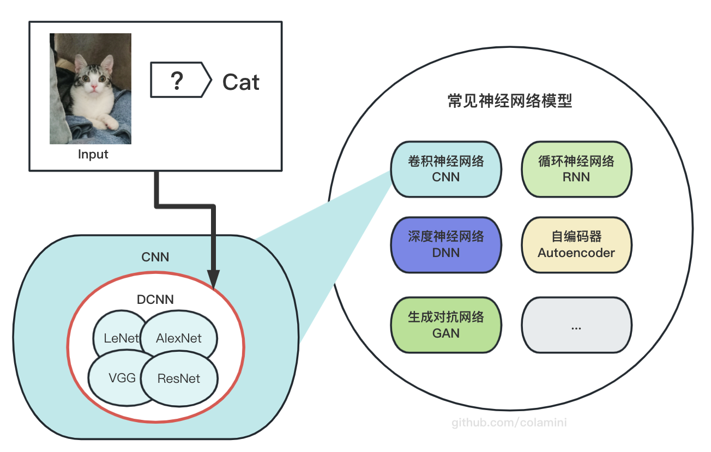

# PyTorch模型定义

[TOC]

## 1. PyTorch模型设计的一般步骤

`PyTorch`提供设计和训练神经网络模型的方法。进行模型设计的一般有以下步骤：


- **1、定义模型架构**：首先需要定义神经网络的模型架构。这通常包括：
  - 输入和输出大小
  - 层数
  - 每层的神经元数量
  - 激活函数
  - ...

- **2、定义损失函数**：接下来需要定义损失函数。损失函数用于评估模型在训练期间的性能，并帮助优化器更新模型参数。`PyTorch`提供了许多内置的损失函数，如
  - 交叉熵损失
  - 均方误差
  - ...

- **3、定义优化器**：优化器用于更新模型参数以最小化损失函数。`PyTorch`提供了许多优化器，如
  - 随机梯度下降
  - Adam
  - ..

- **4、训练模型**：在定义了模型、损失函数和优化器后可以开始训练模型了。在每个epoch中，将模型`输入数据`、`计算损失函数`、`计算梯度`并`更新模型参数`。
<p></p>

- **5、测试模型**：在训练期间，需要定期测试模型以评估其在新数据上的性能。测试过程通常与训练过程相似，但在这种情况下通常不会更新模型参数。
<p></p>

- **6、保存和加载模型**：一旦训练完成，可以保存模型以备将来使用。`PyTorch`提供了许多方法来保存和加载模型，如
    - `torch.save()`
    - `torch.load()`

## 2. 定义神经网络模型

要想定义神经网络模型，需要了解什么是**神经网络模型的基本组成——神经网络层**，下面一起来看看吧💐🍃～～～

### 2.1. 神经网络模型 vs 神经网络层

`神经网络层`是`神经网络模型`的基本组成之一，它是`神经网络`中实现特定功能的一组神经元的组合。

每个`神经网络层`都可以看作是一个函数，将输入数据（通常是一个张量）映射为输出数据。

`神经网络模型`一般由一层层的`神经网络层`组成，共同实现某个特定的任务。如下图所示 ⬇️


`神经网络层`通常具有一些可学习的参数（例如权重和偏置），这些参数会随着神经网络的训练过程而自动更新。这些参数的更新过程是通过`反向传播算法`计算的。


-----
###  2.2. 常见的神经网络层

常见的`神经网络层`有以下几种：

- **全连接层（Fully Connected Layer）**：全连接层是最基本的`神经网络层`之一，通常用于实现输入到输出的线性变换。全连接层的输出神经元数目与输入神经元数目相同。全连接层通常使用`sigmoid`、`ReLU`等激活函数来增加非线性表示能力。

- **卷积层（Convolutional Layer）**：卷积层是用于处理图像和其他多维数据的一种特殊层。卷积层中包含多个`卷积核`，每个`卷积核`对应一个输出通道，输出通道数目即为该层的神经元数目。卷积层通常使用`ReLU`等激活函数来增加非线性表示能力。

- **池化层（Pooling Layer）**：池化层是卷积神经网络中的一种常见层，用于减小特征图的尺寸和参数数量。常见的池化方法包括`最大池化`、`平均池化`等。**池化层通常不使用激活函数**。


以上是一些常见的`神经网络层`设计示例，实际应用中还有许多其他类型的`神经网络层`。根据具体的任务和数据集，可以选择适当的`神经网络层`来构建神经网络模型。

-----
### 2.3. 常见的神经网络模型

由若干神经网络层及其他操作组合在一起，以处理特定的任务的模型，叫做`神经网络模型`，以下是常见的`神经网络模型`实践 ⬇️：


- **卷积神经网络（CNN）**：CNN是一种适用于**图像处理任务**的神经网络模型，它通过卷积层和池化层对图像进行特征提取和降维，最后通过全连接层对图像进行分类或者回归。
<p></p>

- **循环神经网络（RNN）**：RNN是一种适用于序列数据处理任务的神经网络模型，它通过使用循环计算单元（如LSTM、GRU等）来处理输入序列。RNN在**自然语言处理**、**语音识别**等任务中得到广泛应用。
<p></p>

- **深度神经网络（DNN）**：DNN是一种拥有多个隐藏层的神经网络模型，它在**图像分类**、**自然语言处理**、**推荐系统**等多个领域都有广泛应用。
<p></p>


- **自编码器（Autoencoder）**：自编码器是一种通过无监督学习来进行特征提取和数据降维的神经网络模型，它可以用于**图像去噪**、**数据压缩**等任务。
<p></p>

- **生成对抗网络（GAN）**：GAN是一种用于生成数据的神经网络模型，它由一个生成器和一个判别器组成，通过**对抗训练**的方式使得生成器能够生成与真实数据相似的数据。
---

#### 2.3.1. CNN结构示意图
`CNN`是一个神经网络模型，那么它的`神经网络层`的组成情况大概情况是怎么样的呢？

> **CNN（卷积神经网络）** 是由一系列卷积层（Convolutional Layers）、池化层（Pooling Layers）、激活函数层（Activation Layers）、批量归一化层（Batch Normalization Layers）和全连接层（Fully Connected Layers）等组成 ⬇️

> **[Input] -> [Conv2D] -> [Activation] -> [MaxPooling] -> [Conv2D] -> [Activation] -> [MaxPooling] -> [Flatten] -> [Dense] -> [Activation] -> [Dense] -> [Activation] -> [Output]**


- **输入层**：输入层用于接收原始图像数据。
<p></p>

- **卷积层（Conv2D）**：卷积层对输入的图像进行卷积操作，提取图像中的特征。每个卷积层由若干个卷积核组成，每个卷积核提取图像中的一种特定特征。
<p></p>

- **激活函数层（Activation）**：激活函数层对卷积层的输出进行非线性变换，增强网络的表达能力。常用的激活函数包括ReLU、Sigmoid、Tanh等。
<p></p>

- **池化层（MaxPooling）**：池化层用于降低卷积层输出的特征图的尺寸，从而减少网络中的参数数量，避免过拟合。最大池化（MaxPooling）和平均池化（AveragePooling）是两种常用的池化方法。
<p></p>

- **全连接层（Dense）**：全连接层用于将卷积层和池化层的输出进行分类或回归。每个神经元都连接着前一层的所有神经元。
<p></p>

- **输出层（Output）**：输出层给出模型的输出结果，通常用于分类或回归问题。


**需要注意的是，CNN中的每个层都有一些超参数需要进行调整，比如卷积核大小、步长、填充方式、池化核大小等，这些参数会影响网络的性能。**

-------

#### 2.3.2. 常见的图像分类问题?

常见的图像分类问题通常使用的是**深度卷积神经网络（Deep Convolutional Neural Network，DCNN）**。

> **DCNN**是一种基于**卷积神经网络（CNN）**的深度学习模型，由多个[卷积层]和[池化层]交替堆叠而成，具有良好的特征提取能力和分类性能。




> 在**DCNN**中，每个卷积层都可以看作是一个**特征提取器**，用于提取输入数据的不同特征。随着网络深度的增加，特征的抽象程度也逐渐提高，可以更好地表达输入数据的高级特征。

因此，`DCNN`具有良好的特征提取和分类能力，在图像、语音、自然语言处理等领域取得了广泛的应用。


## 3. PyTorch代码实现

在`PyTorch`中，`神经网络层`通常是通过继承**nn.Module**类来实现的。

> **nn.Module**类的主要作用是将神经网络模型的各个层组织在一起，以便于模型的训练和测试。它提供了许多常用的`神经网络层`和操作，如**线性层（nn.Linear）**、**卷积层（nn.Conv2d）**、**池化层（nn.MaxPool2d）**、**激活函数（nn.ReLU）**、**批量归一化（nn.BatchNorm2d）**等等。

例如:
> 1、**nn.Linear**层实现了一个线性变换层，它将输入张量乘以一个权重矩阵并加上一个偏置向量。
2、**nn.Conv2d**层实现了一个二维卷积操作，它将一个二维输入张量与一个卷积核进行卷积操作。
3、**nn.ReLU**层实现了一个修正线性单元激活函数，它将所有负值输入置为0。


下面是一个使用nn.Module类定义一个简单的神经网络模型的示例：

```python
import torch.nn as nn

class SimpleNet(nn.Module):
    def __init__(self, input_dim, hidden_dim, output_dim):
        super().__init__()
        self.fc1 = nn.Linear(input_dim, hidden_dim)
        self.relu = nn.ReLU()
        self.fc2 = nn.Linear(hidden_dim, output_dim)
    
    def forward(self, x):
        out = self.fc1(x)
        out = self.relu(out)
        out = self.fc2(out)
        return out
```
在这个示例中，我们定义了一个名为`SimpleNet`的神经网络模型，它包含两个线性层和一个`ReLU`激活函数。

其中，`__init__`方法用于定义网络的各个层，`forward`方法用于定义网络的`前向传播`过程。当我们调用`forward`方法时，输入x会通过线性层和激活函数得到输出`out`。

最后，`out`被返回作为网络的输出。

> 使用**nn.Module**类的一个好处是，它能够自动跟踪网络的参数和梯度信息，并提供了一些常用的优化器和损失函数，例如SGD、Adam、CrossEntropyLoss等等，以方便地训练和优化神经网络模型。