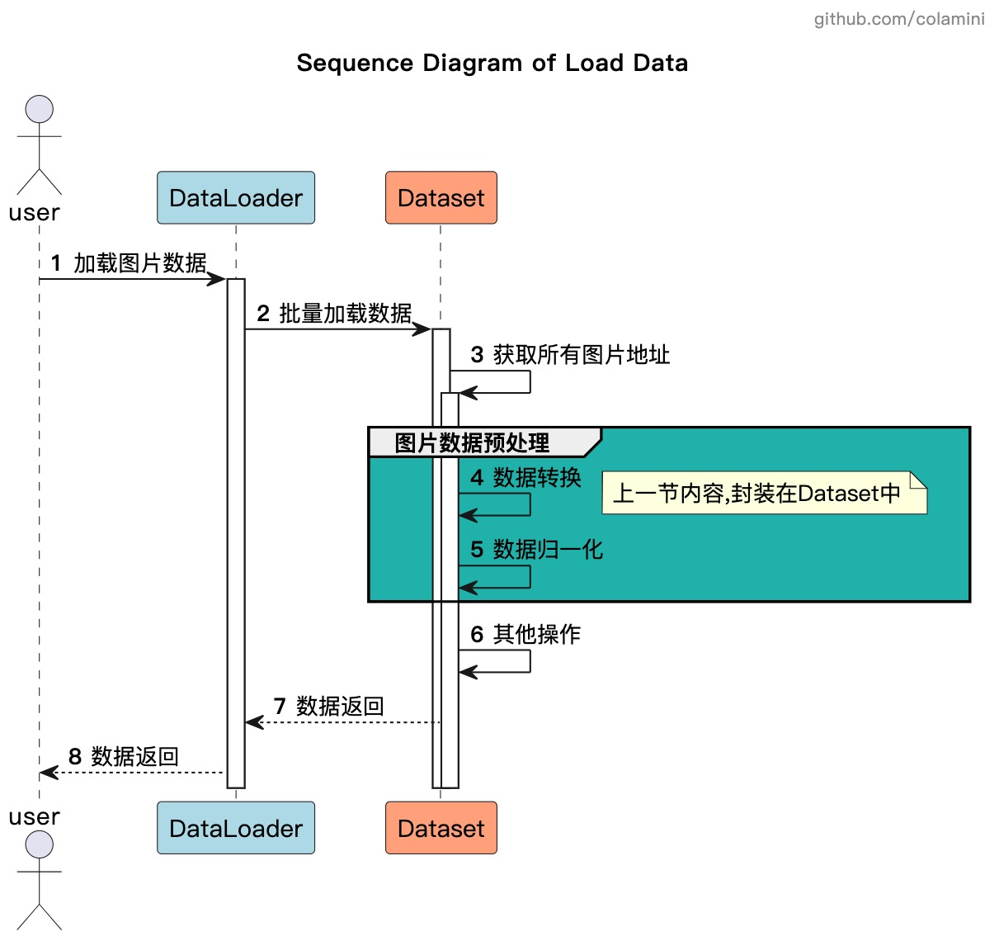
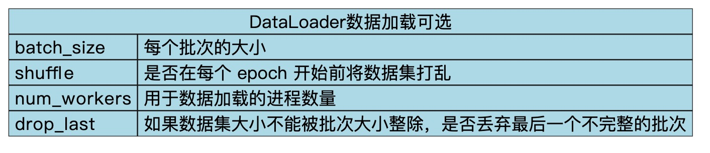

# Pytorch数据预处理


在了解完 [Pytorch数据转换](./Pytorch数据转换.md) 的一些细节之后，我们需要把数据加载出来以供训练。
`PyTorch`提供了已经封装好的`Dataset`和`DataLoader`供我们使用。

> 其中，`Dataset(torch.utils.data.Dataset、torchvision.datasets.ImageFolder等)`数据集中封装了数据转换的一些细节;然后使用`DataLoader(torch.utils.data.DataLoader)`对数据进行并行加载。

具体的数据加载过程我用一张序列图来大概表示⬇️：



## 数据加载 ⚙️

`DataLoader` 是 `PyTorch` 中用于批量加载数据的类。它可以接受任何 `PyTorch` 中的数据集对象（如 `torch.utils.data.Dataset` 类型、`torchvision.datasets.ImageFolder`类型），并将其转换为可以进行批量处理和并行加载的数据加载器。




在使用 `DataLoader` 时，我们可以设置一些参数来控制数据的加载方式和批处理方式，包括：

- **batch_size**：每个批次的大小。
- **shuffle**：是否在每个 epoch 开始前将数据集打乱。
- **num_workers**：用于数据加载的进程数量。
- **drop_last**：如果数据集大小不能被批次大小整除，是否丢弃最后一个不完整的批次。


下面是一个简单的示例，演示如何使用 `DataLoader` 加载一个数据集：

```python

import torch
import torchvision.datasets as datasets
import torchvision.transforms as transforms

# 创建数据集对象
data_path = "/path/to/your/data"
data_transform = transforms.Compose([
    transforms.Resize(256),
    transforms.CenterCrop(224),
    transforms.ToTensor(),
    transforms.Normalize(mean=[0.5, 0.5, 0.5],
                         std=[0.5, 0.5, 0.5])
])
dataset = datasets.ImageFolder(data_path, transform=data_transform)

# 创建数据加载器对象
data_loader = torch.utils.data.DataLoader(dataset, batch_size=32, shuffle=True, num_workers=4)

# 迭代数据集
for images, labels in data_loader:
    # 处理每个批次的数据
    pass

```

- 1、首先创建了一个 `transforms.Compose` 对象(见[Pytorch数据转换](./Pytorch数据转换.md))和一个 `ImageFolder` 数据集对象，用于对图像数据进行预处理和加载。

- 2、使用 `DataLoader` 创建了一个数据加载器对象，并将数据集对象和其他参数作为参数传递给该类。最后，在迭代数据集时，使用 for 循环遍历每个批次的数据，可以对每个批次的数据进行处理。

> 需要注意的是，在使用 `DataLoader` 加载数据时，应该根据硬件设备的性能来调整批次大小和数据加载进程数量，以达到最佳的性能和效率。


