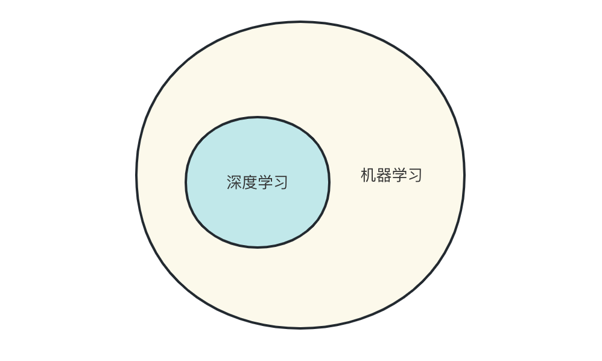
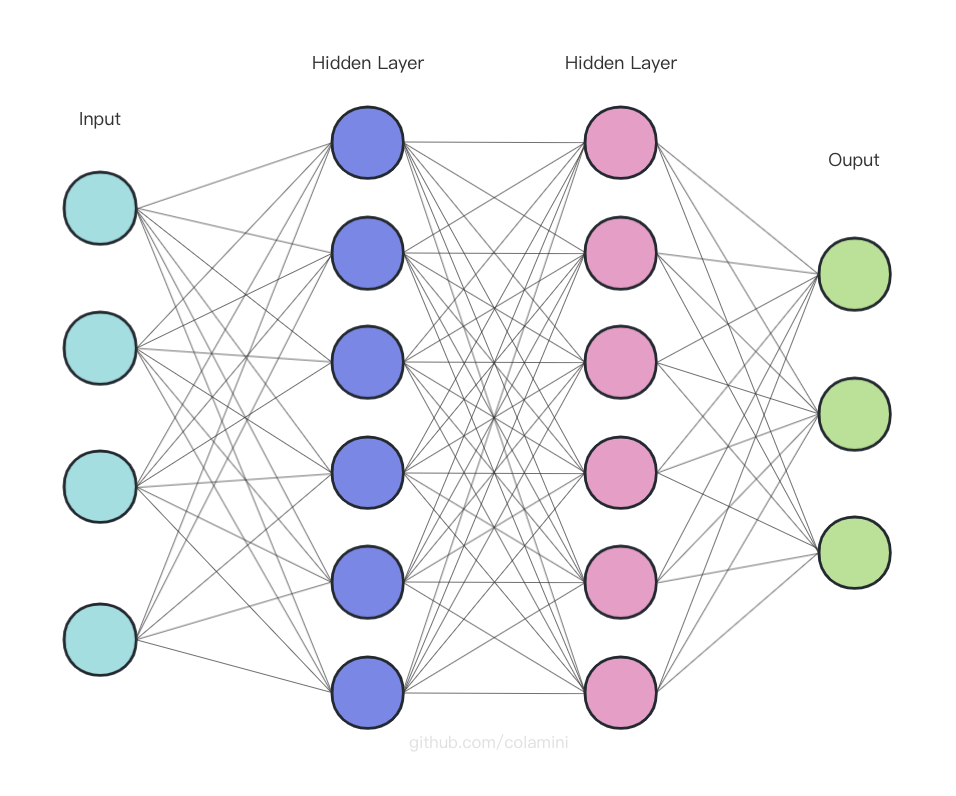
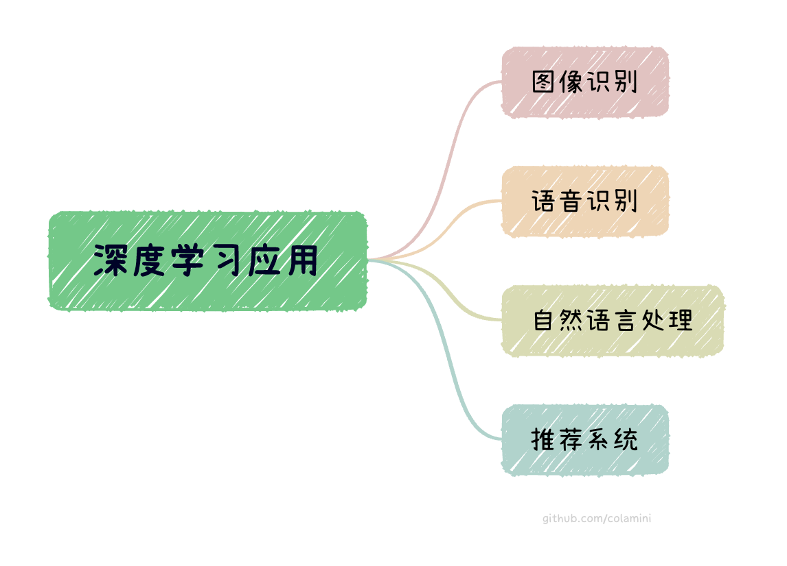
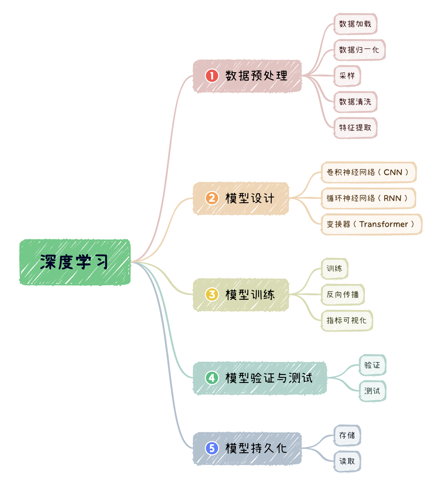

# 深度学习基本介绍
[TOC]

## 1. 深度学习 vs 机器学习
`深度学习（Deep Learning）`是`机器学习（Machine Learning）`的一个分支。`机器学习`是一种从数据中自动学习模型的方法，它旨在让计算机从数据中学习规律，然后利用这些规律进行`预测`、`分类`、`聚类`等任务。

`深度学习`是`机器学习`的一种重要技术手段，它利用多层神经网络进行高效的`特征提取`和`分类`，以实现机器学习任务的自动化和高效化。在机器学习中，深度学习的应用越来越广泛，已经成为了许多领域中最先进的技术之一。

## 2. 深度学习基本介绍

`深度学习`旨在模仿人脑中神经元之间相互作用的方式，通过构建`多层神经网络`来进行高效的数据建模和分析。与传统机器学习技术相比，深度学习的主要特点是可以自动化地学习抽象特征，减少人工特征工程的需求，从而大幅提升模型的性能。

`深度学习`通过将输入数据传递给`多个神经网络层`来学习特征表示，每一层都执行一些简单的计算，例如`线性变换`、`非线性变换`等。这些层被称为`隐藏层`，每个`隐藏层`都可以学习数据的不同方面，最终输出的结果可以通过多个隐藏层的组合得出。

神经网络模型如下图所示⬇️

深度学习广泛应用于`图像识别`、`语音识别`、`自然语言处理`、`推荐系统`等领域。

## 3. 深度学习基本步骤
深度学习包括以下基本的过程：
- **数据预处理**：主要包括`数据加载`、`数据归一化`、`采样`、`数据清洗`、`特征提取`等。
- **模型设计**：设计对应的神经网络模型，常见的神经网络模型有：`卷积神经网络CNN`、`循环神经网络RNN`、`长短期记忆模型LSTM`...
- **模型训练**：神经网络训练的过程包括`定义神经网络`、`迭代输入数据`、`神经网络计算输出`、`计算损失`、`反向传递梯度`、`更新网络权重`、`指标可视化`...
- **模型验证与测试**
- **模型持久化**：对于已经训练好的数据模型，我们可以把它进行`存储`，以便应用时直接进行`读取`

## 4. 深度学习常用框架
### 4.1 PyTorch
[PyTorch数据预处理](./PyTorch入门实践/PyTorch数据预处理.md)
### 4.2 TensorFlow